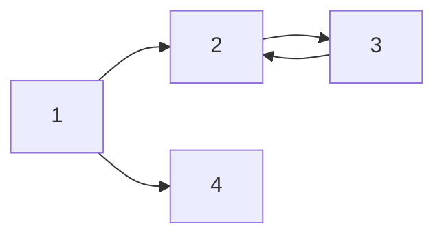

*hello*
_italic_
**bold**
**_italic+bold_**
***italic+bold***
~~hello~~
> (인용)열심히 공부하자

- list 1
- list 2
- list 3
    - A
        - B

1. LIST 1
2. LIST 2
3. LIST 3
    1. A
        1. B

|제목|설명|비고|
|-|-|-|
|안녕|1|2|
|헬로|3|4|

___

[imyours241의 블로그](https://imyours241.tistory.com/)


---

`simple code`
```cpp
#include <stdio.h>

int main(){
    printf("hello world");
    return 0
}
```

___

$a^2 + b^2 = c^2$

$$(\alpha + \beta)^2 = \alpha^2 + 2 \alpha \beta + \beta^2$$

---


    
